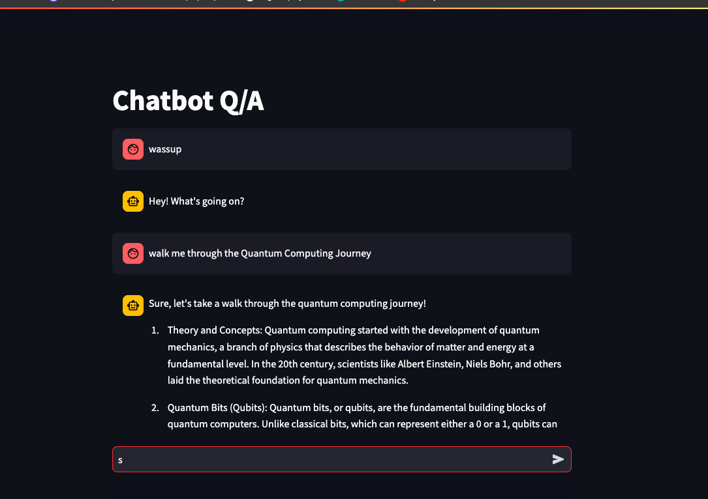

# openai-chatbot

# Screenshot

# step1:
Pip3 install -r requirements.txt

# step2:
Create & Activate virtual Env

#image.png

# step3:
Feed the values in the secrets.toml

# Step4:
Streamlit run server.py
